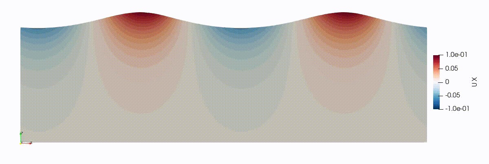

# geometricVoFCartesian
The *geometricVoFCartesian* is an extension library improving two-phase-flow functionalities in OpenFOAM. It features conventional and machine-learning methods to estimate the normal vector and curvature of the fluid-fluid interfaces in geometric Volume-of-Fluid (VoF) framework. 

## Feature Overview
Available methods are as follows:
- **Interface normal vector**: Youngs' Method, Central-Columns Differences Method, Mixed Youngs-Central Method
- **Interface curvature**: Height Function Method, Multilayer-Perceptron (MLP) models (only in 2D currently)

The methods are designed for uniform (isotropic) Cartesian grids. In cases where the interface motion occurs in a smaller subset of the domain, the uniform grid can also be restricted to a smaller zone containing the interface. This is currently achieved using the ```cellSet``` functionality. The rest of the domain can use generic unstructured grids. 

### Fundamental Classes
- ```ijkZone```: Creation and manipulation of the regular-grid zone containing the interface motions.
- ```multilayerPerceptron```: Basic functionalities and data structures for an MLP. Implementation is done using exclusively the C++ Standard Library. Thus, no additional package is required to use new machine learning models.  
- ```uniformStencil```: Parallel operations on local cell blocks.
- ```interfaceForces```: Base class for new curvature models.

### Solver
```interIsoCartFoam```: Extension to ```interIsoFoam``` to feature newly implemented curvature models.

## Machine Learning
### Basics
Machine learning models employ deep MLP architectures to estimate the interfacial curvarture. Two different types of models are developed: 
- **SymMLP**: the symmetry-preserving MLP model using bias-free neurons
- **StdMLP**: the standard MLP model

The models are available in ```benchmarks/casesOF/2D/mlpCurvatureModels```.

### Development 

The code to develop MLP models can be found in ```/tensorflow``` directory. The general procedure can be summarized as follows: 
1.  A synthetic dataset composed of circular arcs of varying sizes is generated:

```bash tensorflow/scripts/genCircles.sh```

2. Around hundred different models are trained with mini-batch optimization:

```bash tensorflow/scripts/mlpTrain.sh```

3. The weights and biases of the TensorFlow models are converted to raw text format, e.g.,

``` python tensorflow/TfToTxt.py mlpCurvatureModels SymMLP```

The ```multilayerPerceptron``` class in OpenFOAM reads these txt files and constructs the corresponding MLP model.

4. The best performing models are selected after conducting analytical tests in python environment (cf. ```/benchmarks/analyticShapes```), and standard benchmark tests in OpenFOAM (cf. ```benchmarks/casesOF/2D```). 

The technical details are elaborated in Önder & Liu (2023). 

## Prerequisites
OpenFOAM v2006 must be installed:

https://www.openfoam.com/download/release-history
## Installation
```
git clone https://github.com/asimonder/geometricVoFCartesian.git
cd geometricVoFCartesian
./Allwclean
./Allwmake
```

## Usage
### Regular-grid zones
The library exclusively works on Cartesian zones. Class ```ijkZone``` handles the regular-grid functionality. It requires the cellset where the interface is located to be specified. If cyclic BCs are considered, they need to defined as well. The dictionary is located in ```system/ijkDict```:

```
{
cellSet refinedCells;
cyclicX true;
}
```
If the grid is uniform everywhere in the domain, then simply use "```cellSet domain;```".

### New curvature models
New curvature-estimation models are configured in ```system/curvatureDict```, e.g., for the height function method,

```
curvatureModel heightFunction;
heightFunctionParams
{
  nMax 3;
}
```

Here, nMax is the number of cells neighbouring the central cell in one direction. For instance, if the height function is obtained from 7 cells along the height, then nMax=3 so that 3+1+3=7. This yields 7x3x3 stencil in 3D.

MLP model is configured as follows:

```
curvatureModel mlpCurvature;
mlpParams
{
  mlpModel "../../mlpCurvatureModels/SymMLP";
  interfaceTol 1e-3;
  zonalModel true;
  useScaling true;
  xoffsetInput 0;
  gainInput 2;
  yminInput -1;
  yminOutput 0.;
  gainOutput 1.0;
  xoffsetOutput 0.0;
}
```
```mlpModel``` specifies the full path to txt files containing weights and biases of the model. ```interfaceTol``` is the volume-fraction threshold for curvature to be non-zero. ```zonalModel``` has to be set ```true``` for symmetry-preserving MLP. If the MLP model uses input-output scaling, then ```useScaling``` is set to ```true```, and ```xoffsetInput```, ```gainInput```, ```yminInput```, ```yminOutput```, ```gainOutput``` and ```xoffsetOutput``` have to be specified.

## Examples 
Several benchmark cases are provided in ```benchmarks/casesOF``` directory:
- **2D**: stationary bubble, rising bubble, standing capillary wave, parasitic capillary ripples. See Sec. 5 in Önder & Liu (2023) for results.


- **3D**: stationary bubble, translating bubble

## Publications 
 Önder, A., & Liu, P. L.-F. (2023). Deep learning of interfacial curvature: a symmetry-preserving approach for the volume of fluid method. *Journal of Computational Physics*, 112110.

## Author
Asim Önder (asim.onder@gmail.com)
